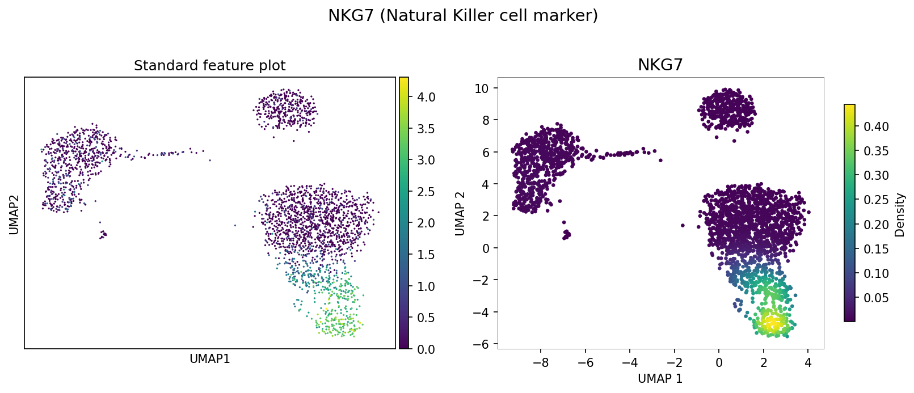
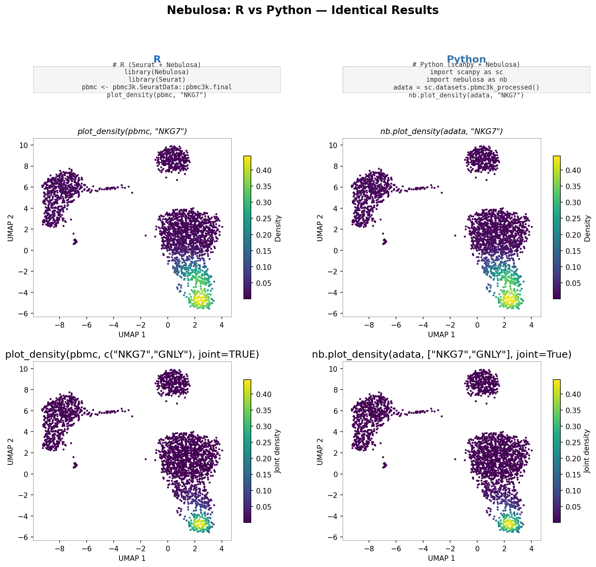
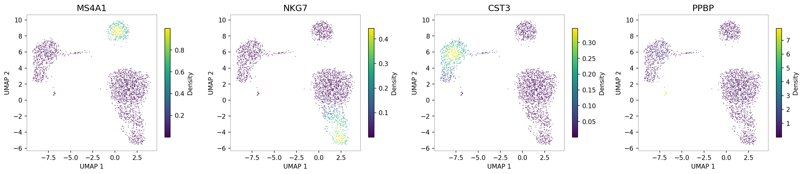
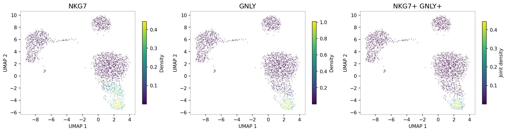

# Nebulosa

[](https://pypi.org/project/nebulosa/)
[](https://nebulosa.readthedocs.io)
[](https://www.gnu.org/licenses/gpl-3.0)

**Single-cell data visualization using kernel gene-weighted density estimation.**

Nebulosa is a Python package (ported from the
[original R/Bioconductor package](https://bioconductor.org/packages/Nebulosa))
that recovers gene expression signals lost to dropout in single-cell data by
using weighted kernel density estimation on low-dimensional embeddings. It
integrates natively with [scanpy](https://scanpy.readthedocs.io) and
[AnnData](https://anndata.readthedocs.io).

## Motivation

Standard feature plots in single-cell analysis are plagued by sparsity — many
cells show zero expression even for marker genes, making it hard to see
biological signal. Nebulosa addresses this by computing a gene-weighted kernel
density estimate (KDE) on the embedding space, effectively smoothing expression
over neighbouring cells.

| Standard feature plot | Nebulosa density plot |
|:-----:|:-----:|
| Sparse, hard to interpret | Smooth, recovers signal |



## R vs Python

Nebulosa was originally an R/Bioconductor package for Seurat and
SingleCellExperiment objects. This Python port provides an equivalent API for
the scanpy/AnnData ecosystem, producing identical density estimates.



<table>
<tr><th>R (Seurat)</th><th>Python (scanpy)</th></tr>
<tr>
<td>

```r
library(Nebulosa)
library(Seurat)
pbmc <- pbmc3k.SeuratData::pbmc3k.final
plot_density(pbmc, "NKG7")
plot_density(pbmc, c("NKG7", "GNLY"),
             joint = TRUE)
```

</td>
<td>

```python
import scanpy as sc
import nebulosa as nb
adata = sc.datasets.pbmc3k_processed()
nb.plot_density(adata, "NKG7")
nb.plot_density(adata, ["NKG7", "GNLY"],
                joint=True)
```

</td>
</tr>
</table>

## Installation

```bash
pip install nebulosa
```

With scanpy (recommended):

```bash
pip install "nebulosa[scanpy]"
```

## Quick start

```python
import scanpy as sc
import nebulosa as nb

adata = sc.datasets.pbmc3k_processed()

# Single gene density plot
nb.plot_density(adata, "NKG7")
```

### Multi-marker panels

Visualize multiple markers at once to identify cell populations:

```python
nb.plot_density(adata, ["MS4A1", "NKG7", "CST3", "PPBP"], ncols=4)
```



### Joint density

Find co-expressing cell populations by computing the product of individual
gene densities:

```python
nb.plot_density(adata, ["NKG7", "GNLY"], joint=True)
```



## API

| Function | Purpose |
|----------|---------|
| `nb.plot_density(adata, features)` | Main visualization function |
| `nb.calculate_density(weights, coords)` | Compute density values programmatically |
| `nb.wkde2d(x, y, w)` | Low-level weighted 2D KDE |

### Key parameters

| Parameter | Description | Default |
|-----------|-------------|---------|
| `joint` | Compute joint density across features | `False` |
| `reduction` | Embedding key in `adata.obsm` | Auto-detect (`X_umap`) |
| `method` | `"wkde"` (custom) or `"ks"` (scipy) | `"wkde"` |
| `adjust` | Bandwidth adjustment factor | `1.0` |
| `cmap` | Matplotlib colormap | `"viridis"` |
| `layer` | Expression layer | `adata.X` |

## How it differs from similar tools

| Tool | Approach | Use case |
|------|----------|----------|
| `scanpy.tl.embedding_density` | Unweighted KDE per category | Where are cells of group X? |
| pyUCell | Rank-based scoring + KNN smoothing | Gene signature scoring |
| **Nebulosa** | Gene-weighted KDE on embeddings | Recovering dropout signal |

## Documentation

- [Full documentation](https://nebulosa.readthedocs.io) (ReadTheDocs)
- [Tutorial notebook](vignettes/nebulosa_tutorial.ipynb) (PBMC 3K walkthrough)

## Citation

If you use Nebulosa, please cite:

> Alquicira-Hernandez, J., Powell, J.E. Nebulosa recovers single-cell gene
> expression signals by kernel density estimation.
> *Bioinformatics*, 37(16), 2485-2487, 2021.
> [doi:10.1093/bioinformatics/btab003](https://doi.org/10.1093/bioinformatics/btab003)
